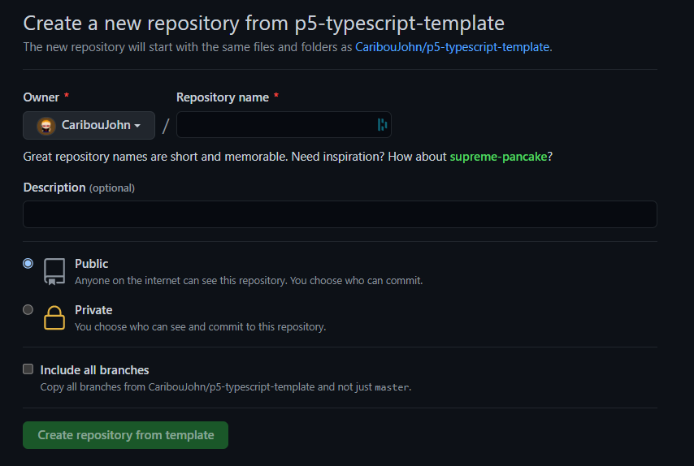
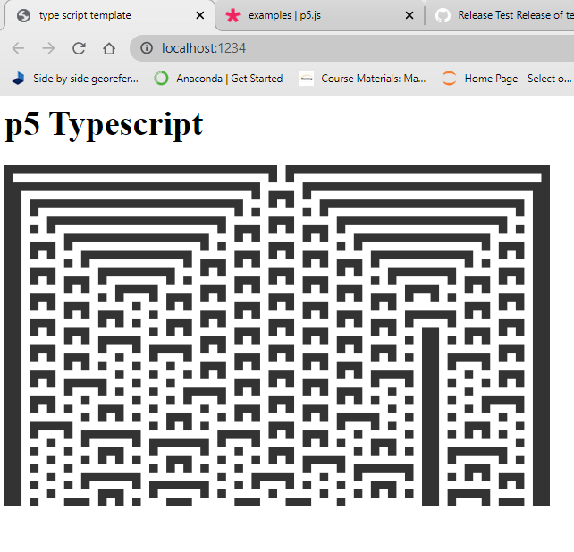

# P5 in vscode,node,typescript, and parcel(2). 
## How to Use this template

N.B. a version of node and npm must be installed - [Node download page](https://nodejs.org/en/download/)

Once node in installed, ___Either___ 

* download the source for this project from the [Current](https://github.com/CaribouJohn/p5-typescript-template/releases/tag/v0.1) release.

___OR___

*  click the ```Use this template``` button on the top of the repo and it will guide you through creating your own version of the repository that you can then work on. 



Now you can either clone your repo, or unzip the sources, into a directory to hold your project (E.G. <some-path-of-your-choosing>/myproject). 

Once you have a local copy of the this repo, navigate into your project. 
* E.g ```cd <some-path-of-your-choosing>/myproject``` or use explorer to navigate there. 

Now if you are on the command line start visual studio code using ```code .``` or in explorer right click and choose ```open with code```

## Build 

the project uses npm scripting to invoke parcel in vscode these can be seen in the NPM SCRIPTS view.


(If you are on the command line then running ```npm run start``` from the project directory will run that command (or ```npm run build```))

__start__ will compile the code 


and open a browser window



__build__ will generate a set of files that will allow you to publish the pag. 


## How it works

This is the first iteration of the library and as such it simply allows me to get started. I decided to include the p5 code from the [Wolfram CA example](https://p5js.org/examples/simulate-wolfram-ca.html)

The code will show the minimal changes required to get the examples running (mostly the addition of ```p5.``` to calls)

The html file references the ```src/index.ts``` rather than the javascript and parcel will handle the rest.

The example uses [Instanced mode](https://p5js.org/reference/#/p5/p5)
```

const sketch = (p5: P5) => {
    p5.setup = () => {
        p5.createCanvas(640, 400);
        ...
    };

    p5.draw = () => {
        ...
    };

};

let _instance = new P5(sketch);
```

## Disclaimer
Various online sources helped me get to this point, but especially https://github.com/Gaweph/p5-typescript-starter (Thanks!) 

This is mainly for my benefit but if you gain anything from it feel free to use it in any way consistant with the MIT Licence I am inheriting from [here](https://github.com/Gaweph/p5-typescript-starter). 
